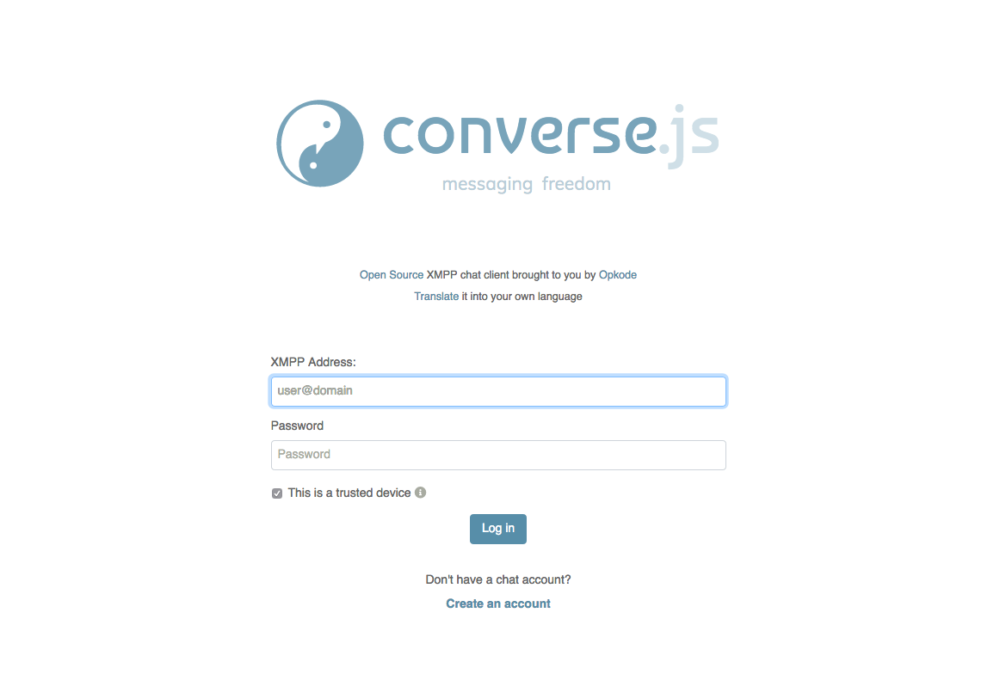

# Converse for YunoHost

[](https://dash.yunohost.org/appci/app/converse)    
[](https://install-app.yunohost.org/?app=converse)

*[Lire ce readme en français.](./README_fr.md)*

> *This package allow you to install Converse quickly and simply on a YunoHost server. 
If you don’t have YunoHost, please see [here](https://yunohost.org/#/install) to know how to install and enjoy it.*

## Overview
Converse is a free and open-source XMPP chat client written in JavaScript which can be tightly integrated into any website.
The benefit of using converse.js as opposed to relying on a SaaS (software-as-a-service) solution, is that your users can have a much more customized, streamlined and integrated webchat experience and that you have control over the data.

**Shipped version:** 7.0.5

## Screenshots



## Demo

* [Official demo](https://inverse.chat/)

## Documentation

 * Official documentation: https://conversejs.org/docs/html/index.html
 * YunoHost documentation: If specific documentation is needed, feel free to contribute.

#### Supported architectures

* x86-64 - [](https://ci-apps.yunohost.org/ci/apps/converse/)
* ARMv8-A - [](https://ci-apps-arm.yunohost.org/ci/apps/converse/)

## Links

 * Report a bug: https://github.com/YunoHost-Apps/converse_ynh/issues
 * App website: http://conversejs.org/
 * Upstream app repository: https://github.com/conversejs/converse.js
 * YunoHost website: https://yunohost.org/

---

## Developers info

Please do your pull request to the [testing branch](https://github.com/YunoHost-Apps/converse_ynh/tree/testing).

To try the testing branch, please proceed like that.
```
sudo yunohost app install https://github.com/YunoHost-Apps/converse_ynh/tree/testing --debug
or
sudo yunohost app upgrade converse -u https://github.com/YunoHost-Apps/converse_ynh/tree/testing --debug
```
